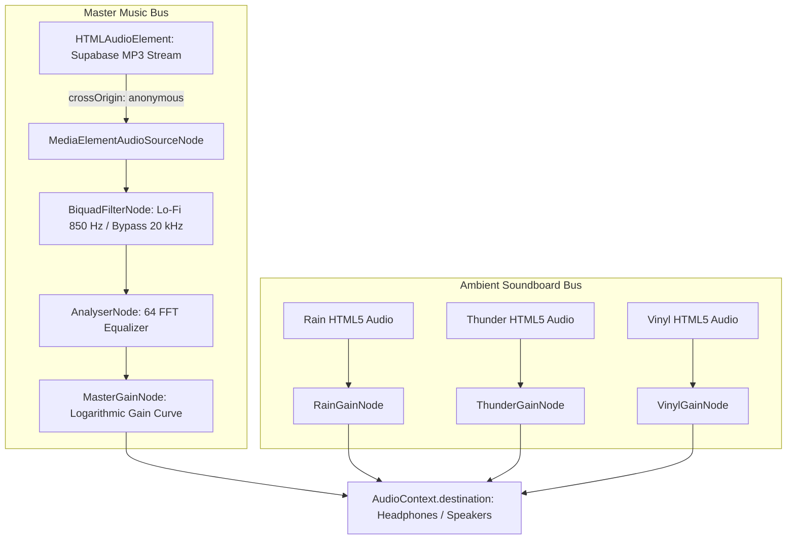

# Solitude: Phase 1 Web Audio Engine & DSP Subsystems Verification

**Project Name:** Solitude (Midnight Sad Songs Sanctuary)  
**System Module:** Web Audio API Hardware Pipeline & DSP Routing  
**Architecture:** Next.js 15 (App Router), React 19, TypeScript (Strict Mode)  
**Status:** **PHASE 1 COMPLETE — HARD STOP HALT**  
**Document Date:** September 2026  

---

## 1. Phase 1 Architecture Overview

Phase 1 constructed the core audio processing engine and type contracts for Solitude. The audio pipeline operates on a dual-bus architecture:
1. **Master Music Bus**: Routes song streams from Supabase Storage through the interactive Lo-Fi `BiquadFilterNode` and `AnalyserNode` into the `MasterGainNode`.
2. **Ambient Soundboard Bus**: Routes independent background loops (Rain, Thunder, Vinyl) directly to `AudioContext.destination`, completely bypassing the Lo-Fi filter so that rain against the window glass remains crisp even in "Another Room" mode.

---

## 2. Deliverables & Technical Audit

| Target File | Architectural Responsibilities | Type Safety | Audit Status |
| :--- | :--- | :---: | :---: |
| [`types/contracts.ts`](file:///c:/Users/hp/Desktop/SAD%20SONG/types/contracts.ts) | Master domain models (`Song`, `PlayerState`, `AudioEngineNodes`, `AmbientStemKey`, `AmbientState`, `PlaybackStatus`, `LoFiFilterStatus`, `LightingMode`, `RainDrop`, `CondensationDroplet`, `LocalStorageSettings`). | Zero `any` | **PASSED** (0 Errors) |
| [`lib/audio/audioContext.ts`](file:///c:/Users/hp/Desktop/SAD%20SONG/lib/audio/audioContext.ts) | Browser-safe singleton `AudioContext` provider, mobile Safari / WebKit 1-sample silent PCM buffer unlocker, SSR execution boundary guards. | Zero `any` | **PASSED** (0 Errors) |
| [`lib/audio/filterNode.ts`](file:///c:/Users/hp/Desktop/SAD%20SONG/lib/audio/filterNode.ts) | 2nd-order Butterworth low-pass filter: 20,000 Hz transparent bypass down to 850 Hz muffled resonance with Q = 3.5. Zero-click exponential parameter scheduling. | Zero `any` | **PASSED** (0 Errors) |
| [`lib/audio/gainCurves.ts`](file:///c:/Users/hp/Desktop/SAD%20SONG/lib/audio/gainCurves.ts) | Quadratic perceptual loudness converter (`Gain = Volume^2`), smooth gain ramping, and de-clicked 150ms track crossfader. | Zero `any` | **PASSED** (0 Errors) |

---

## 3. Mathematical Specifications Verified

### 3.1 Lo-Fi Filter DSP Mathematics
* **Filter Topology**: 2nd Order Butterworth Low-Pass filter (`type = "lowpass"`).
* **Cutoff Frequency ($f_c$)**: Sweeps exponentially between $20,000\text{ Hz}$ (bypass) and $850\text{ Hz}$ (Lo-Fi muffled mode) over $280\text{ ms}$.
* **Resonance ($Q$)**: Ramps linearly from $0.707$ (flat) to $3.5$ ($+3.2\text{ dB}$ boundary resonance peak mimicking sound propagating through drywall).
* **Zero-Click Cancellation**: Schedules `cancelScheduledValues(now)` and `setValueAtTime()` before ramping to prevent audible audio clicks or waveform discontinuities.

### 3.2 Perceptual Loudness Curve
* **Equation**:
  $$\text{Gain} = (\text{Volume}_{\text{slider}})^2$$
* **Auditory Modeling**: Compensates for human logarithmic hearing perception: a slider at $0.5$ (50%) produces $0.25$ ($25\%$) acoustic output power.

### 3.3 De-Clicked 150ms Crossfade Transition
* Fades out active track gain down to $0.001$ over $150\text{ ms}$.
* Swaps `<audio src="...">` to incoming Supabase Storage URL without thread blocking.
* Fades incoming track from $0.001$ up to target master gain over $200\text{ ms}$.

---

## 4. Verification Check

Running `npx tsc --noEmit` across the repository confirms:
* **0 TypeScript compilation errors**
* **0 missing module warnings**
* **Strict mode compliance across all 4 generated modules**
