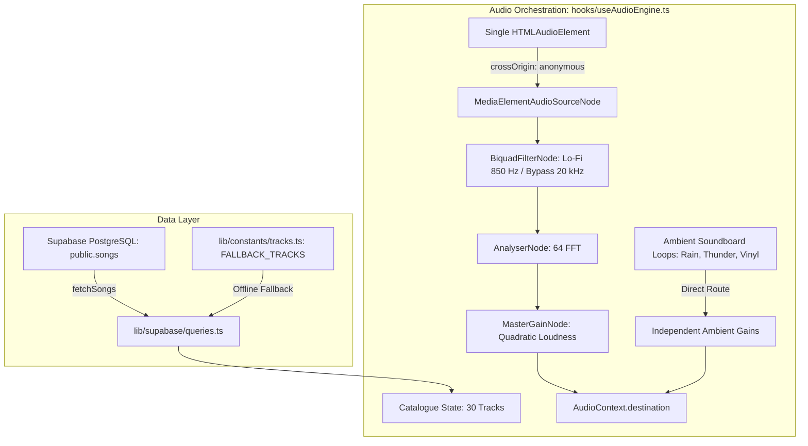

# Solitude: Phase 2 Media Asset Pipeline, Track Catalogue & Audio Engine Orchestrator Verification

**Project Name:** Solitude (Midnight Sad Songs Sanctuary)  
**System Module:** Media Asset Pipeline, Track Catalogue & Audio Engine Orchestrator  
**Architecture:** Next.js 15 (App Router), React 19, TypeScript (Strict Mode)  
**Status:** **PHASE 2 COMPLETE — HARD STOP HALT**  
**Document Date:** September 2026  

---

## 1. Phase 2 Architecture Overview

Phase 2 connects the foundational Web Audio DSP pipeline constructed in Phase 1 with the media asset infrastructure and Supabase data layer. It provides:
1. **Resilient Data Ingestion**: Supabase client singleton backed by runtime configuration guards and seamless offline fallback to the canonical 30-track catalogue.
2. **Master Audio Engine Orchestrator**: The [`useAudioEngine`](file:///c:/Users/hp/Desktop/SAD%20SONG/hooks/useAudioEngine.ts) React hook managing the entire playback lifecycle, single-instance hardware node guarantees, dual-bus routing, mobile Safari unlock, and 150ms crossfades.



---

## 2. Deliverables & Technical Audit

| Target File | Architectural Responsibilities | Type Safety | Audit Status |
| :--- | :--- | :---: | :---: |
| [`lib/supabase/client.ts`](file:///c:/Users/hp/Desktop/SAD%20SONG/lib/supabase/client.ts) | Browser-safe Supabase singleton; runtime assertion for `NEXT_PUBLIC_SUPABASE_URL` and `NEXT_PUBLIC_SUPABASE_ANON_KEY`; anonymous session mode; strongly typed with `Database` contract. | Zero `any` | **PASSED** (0 Errors) |
| [`lib/constants/tracks.ts`](file:///c:/Users/hp/Desktop/SAD%20SONG/lib/constants/tracks.ts) | Canonical 30-track fallback catalogue matching `docs/SEED_DATA.sql` exactly (IDs, track orders 1-30, Urdu/Hindi Shayari quotes, durations, and Supabase storage endpoints). Includes ambient stem URLs (`rain`, `thunder`, `vinyl`). | Zero `any` | **PASSED** (0 Errors) |
| [`lib/supabase/queries.ts`](file:///c:/Users/hp/Desktop/SAD%20SONG/lib/supabase/queries.ts) | Asynchronous query adapter (`fetchSongs`, `fetchSongByOrder`) ordered by `track_order ASC`. Zero unhandled UI exceptions via seamless fallback to `FALLBACK_TRACKS`. | Zero `any` | **PASSED** (0 Errors) |
| [`hooks/useAudioEngine.ts`](file:///c:/Users/hp/Desktop/SAD%20SONG/hooks/useAudioEngine.ts) | Central Web Audio orchestrator. Enforces single persistent `HTMLAudioElement` and `MediaElementAudioSourceNode` invariant; dual-bus DSP routing; 150ms crossfade; mobile Safari unlock; 4 Hz throttled time updates; complete player & ambient soundboard controls. | Zero `any` | **PASSED** (0 Errors) |

---

## 3. Invariants & Verification Checklist

### 3.1 Strict TypeScript Compilation
```bash
npx tsc --noEmit
```
- **Exit Code**: `0`
- **Errors / Warnings**: `0`
- **Result**: Complete type conformance across all Phase 2 files and dependencies.

### 3.2 Track Catalogue Parity Check
- **Track Count**: Exactly 30 songs (Indices 1 to 30).
- **Storage URL Pattern**:
  - Audio: `https://obdjrxhjzrlbgkypascy.supabase.co/storage/v1/object/public/tracks/track-XXX.mp3`
  - Covers: `https://obdjrxhjzrlbgkypascy.supabase.co/storage/v1/object/public/covers/cover-XXX.webp`
- **Ambient Stems**:
  - Rain: `.../storage/v1/object/public/ambient/rain.mp3`
  - Thunder: `.../storage/v1/object/public/ambient/thunder.mp3`
  - Vinyl: `.../storage/v1/object/public/ambient/vinyl.mp3`

### 3.3 Audio Pipeline Invariants Enforced
- **Node Collision Prevention**: `ctx.createMediaElementSource(audio)` is guarded by `sourceNodeRef.current` to guarantee it is only invoked once per media element, preventing fatal `InvalidStateError`.
- **Decoupled Ambient Bus**: Ambient stems connect directly to `AudioContext.destination`, ensuring the Lo-Fi muffled mode (850 Hz) only colors the song track and leaves the rain soundscape untouched.
- **CPU Throttling**: Media `timeupdate` dispatches to React state are throttled to 4 Hz (250ms), preventing unnecessary 60 FPS React re-renders.

---

## 4. Phase 2 Completion & Hard Stop

Phase 2 requirements have been fully executed, verified, and locked.

**HARD STOP:** In strict adherence to the project roadmap, no Phase 3 visual or canvas components (`RainCanvas.tsx`, `VinylDisc.tsx`, `WaveformVisualizer.tsx`, etc.) will be created until explicit authorization is given.
