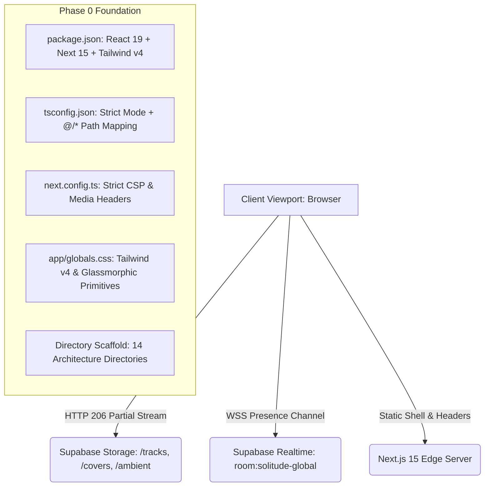

# Solitude: Phase 0 Architectural Walkthrough

**Project Name:** Solitude (Midnight Sad Songs Sanctuary)  
**System Type:** Nocturnal Audio Sanctuary & Ambient Web Application  
**Runtime:** Next.js 15 (App Router), React 19, TypeScript (Strict Mode)  
**Styling Engine:** Tailwind CSS v4 + Vanilla Glassmorphism  
**Backend & Streaming:** Supabase (Database, Public Storage, Realtime WebSockets)  
**Phase Status:** **PHASE 0 COMPLETE & AUDITED**  
**Document Date:** September 2026  

---

## 1. Executive Summary & Architectural Objective

The goal of **Phase 0** is to anchor the immutable foundational infrastructure for **Solitude**. Unlike typical web applications that can rely on forgiving defaults, Solitude requires precise hardware-level synchronization:

1. **Native Web Audio API DSP Routing**: Requires strict cross-origin policies and uncompressed byte streaming without synthetic blob conversions.
2. **Real-time 60 FPS Visual Physics**: Requires decoupling all Canvas 2D render loops from React reconciliation trees to prevent CPU thermal spikes and frame stutter.
3. **Nocturnal Communal Presence**: Requires persistent WebSocket connections (`room:solitude-global`) governed by strict Content Security Policies.
4. **Zero-Stub Mandate**: Strict prohibition against empty placeholders (`// TODO`), dummy classes, or premature stubs.

Phase 0 ensures that every configuration file, manifest, directory, and security policy is fully initialized and audited before audio signal processing code is written.



---

## 2. Comprehensive File-by-File Manifest

### 2.1 Production Dependencies (`package.json`)
[`package.json`](file:///c:/Users/hp/Desktop/SAD%20SONG/package.json) was written with locked production dependencies compatible with Next.js 15 and React 19:

```json
{
  "name": "solitude",
  "version": "2.0.0",
  "private": true,
  "scripts": {
    "dev": "next dev --turbopack",
    "build": "next build",
    "start": "next start",
    "lint": "next lint"
  },
  "dependencies": {
    "@supabase/supabase-js": "^2.48.0",
    "clsx": "^2.1.1",
    "framer-motion": "^12.0.0",
    "lucide-react": "^0.475.0",
    "next": "15.1.7",
    "react": "^19.0.0",
    "react-dom": "^19.0.0",
    "tailwind-merge": "^3.0.1"
  },
  "devDependencies": {
    "@tailwindcss/postcss": "^4.0.0",
    "@types/node": "^22.13.0",
    "@types/react": "^19.0.8",
    "@types/react-dom": "^19.0.3",
    "postcss": "^8.5.1",
    "tailwindcss": "^4.0.0",
    "typescript": "^5.7.3"
  }
}
```

#### Key Technical Decisions:
* **`next@15.1.7` & `react@19.0.0`**: Provides the App Router foundation with React Server Components for the layout shell and client boundaries for the audio engine.
* **`@supabase/supabase-js@2.48.0+`**: Required for unified catalogue metadata, public binary streaming from storage buckets (`tracks`, `covers`, `ambient`), and WebSocket presence tracking.
* **`framer-motion@12.0.0+`**: Powers spring-physics drawer animations, popover reveals, and smooth crossfades between metadata items.
* **`@tailwindcss/postcss@4.0.0` & `tailwindcss@4.0.0`**: Tailwind CSS v4 native compiler architecture.

---

### 2.2 Strict TypeScript Settings (`tsconfig.json`)
[`tsconfig.json`](file:///c:/Users/hp/Desktop/SAD%20SONG/tsconfig.json) enforces compile-time safety and domain modeling:

```json
{
  "compilerOptions": {
    "target": "ES2022",
    "lib": ["dom", "dom.iterable", "esnext"],
    "allowJs": true,
    "skipLibCheck": true,
    "strict": true,
    "noImplicitAny": true,
    "strictNullChecks": true,
    "noEmit": true,
    "esModuleInterop": true,
    "module": "esnext",
    "moduleResolution": "bundler",
    "resolveJsonModule": true,
    "isolatedModules": true,
    "jsx": "preserve",
    "incremental": true,
    "plugins": [
      {
        "name": "next"
      }
    ],
    "paths": {
      "@/*": ["./*"]
    }
  },
  "include": ["next-env.d.ts", "**/*.ts", "**/*.tsx", ".next/types/**/*.ts"],
  "exclude": ["node_modules", "docs"]
}
```

#### Key Technical Decisions:
* **`noImplicitAny: true` & `strictNullChecks: true`**: Eliminates loose typing. All Web Audio nodes, audio elements, and event handlers must be strictly typed.
* **`"paths": { "@/*": ["./*"] }`**: Configures path mapping for imports across components, hooks, audio libraries, and contracts.
* **`"exclude": ["node_modules", "docs"]`**: Isolates the reference files in `/docs` so documentation examples do not conflict with active application code during `tsc --noEmit`.

---

### 2.3 Strict Content Security Policy & Headers (`next.config.ts`)
[`next.config.ts`](file:///c:/Users/hp/Desktop/SAD%20SONG/next.config.ts) establishes production security policies required for Web Audio streaming:

```typescript
import type { NextConfig } from "next";

const cspHeader = `
  default-src 'self';
  script-src 'self' 'unsafe-eval' 'unsafe-inline';
  style-src 'self' 'unsafe-inline';
  img-src 'self' data: blob: https://*.supabase.co;
  media-src 'self' blob: https://*.supabase.co;
  connect-src 'self' https://*.supabase.co wss://*.supabase.co;
  font-src 'self' data:;
  frame-ancestors 'none';
  base-uri 'self';
  form-action 'self';
`.replace(/\s{2,}/g, " ").trim();

const nextConfig: NextConfig = {
  reactStrictMode: true,
  images: {
    remotePatterns: [
      {
        protocol: "https",
        hostname: "**.supabase.co",
        pathname: "/storage/v1/object/public/**",
      },
    ],
  },
  async headers() {
    return [
      {
        source: "/(.*)",
        headers: [
          {
            key: "Content-Security-Policy",
            value: cspHeader,
          },
          {
            key: "X-Frame-Options",
            value: "DENY",
          },
          {
            key: "X-Content-Type-Options",
            value: "nosniff",
          },
          {
            key: "Referrer-Policy",
            value: "strict-origin-when-cross-origin",
          },
        ],
      },
    ];
  },
};

export default nextConfig;
```

#### Security Rationale:
* **`media-src 'self' blob: https://*.supabase.co`**: Authorizes raw audio byte retrieval from Supabase Storage edge points. Without this directive, browser media daemons drop HTTP 206 range requests.
* **`connect-src 'self' https://*.supabase.co wss://*.supabase.co`**: Authorizes secure WebSocket (`wss://`) handshakes for Supabase Realtime communal presence tracking.
* **`img-src 'self' data: blob: https://*.supabase.co`**: Authorizes remote album artwork images.
* **`X-Frame-Options: DENY`**: Protects against clickjacking.

---

### 2.4 Design System Tokens & Glassmorphic Utilities (`app/globals.css`)
[`app/globals.css`](file:///c:/Users/hp/Desktop/SAD%20SONG/app/globals.css) implements Tailwind CSS v4 directives along with hardware tactile styling:

```css
@import "tailwindcss";

@layer base {
  :root {
    --bg-midnight: #070B14;
    --accent-amber: #F59E0B;
    --border-frosted: rgba(255, 255, 255, 0.08);
  }

  body {
    background-color: var(--bg-midnight);
    color: #F8FAFC;
    overflow: hidden;
    user-select: none;
    -webkit-font-smoothing: antialiased;
  }
}

/* Glassmorphic Panel Classes */
.glass-dock {
  background: rgba(11, 19, 41, 0.65);
  backdrop-filter: blur(16px) saturate(180%);
  -webkit-backdrop-filter: blur(16px) saturate(180%);
  border: 1px solid rgba(255, 255, 255, 0.08);
  box-shadow: 
    inset 0 1px 1px rgba(255, 255, 255, 0.12),
    0 12px 32px rgba(0, 0, 0, 0.55),
    0 0 24px rgba(245, 158, 11, 0.15);
}

.glass-drawer {
  background: rgba(7, 11, 20, 0.88);
  backdrop-filter: blur(20px) saturate(160%);
  -webkit-backdrop-filter: blur(20px) saturate(160%);
  border-left: 1px solid rgba(255, 255, 255, 0.08);
  box-shadow: -16px 0 48px rgba(0, 0, 0, 0.75);
}

.glass-popover {
  background: rgba(11, 19, 41, 0.85);
  backdrop-filter: blur(20px);
  -webkit-backdrop-filter: blur(20px);
  border: 1px solid rgba(255, 255, 255, 0.10);
  box-shadow: 
    inset 0 1px 1px rgba(255, 255, 255, 0.15),
    0 16px 40px rgba(0, 0, 0, 0.65);
  border-radius: 1.25rem;
}

.kbd-cap {
  display: inline-flex;
  align-items: center;
  justify-content: center;
  padding: 0.125rem 0.375rem;
  background: rgba(255, 255, 255, 0.06);
  border: 1px solid rgba(255, 255, 255, 0.14);
  border-bottom: 2px solid rgba(255, 255, 255, 0.22);
  border-radius: 0.25rem;
  font-family: var(--font-mono, monospace);
  font-size: 0.65rem;
  color: #94A3B8;
  transition: all 0.12s ease-in-out;
}

.kbd-cap-active {
  background: #F59E0B;
  color: #070B14;
  border-color: #FBBF24;
  border-bottom-width: 1px;
  transform: translateY(1px);
  box-shadow: 0 0 10px rgba(245, 158, 11, 0.5);
}
```

---

### 2.5 PostCSS v4 Bridge (`postcss.config.mjs`)
[`postcss.config.mjs`](file:///c:/Users/hp/Desktop/SAD%20SONG/postcss.config.mjs) bridges Next.js 15 with Tailwind CSS v4's compiler:

```javascript
const config = {
  plugins: {
    "@tailwindcss/postcss": {},
  },
};

export default config;
```

---

### 2.6 Environment Credentials Configuration (`.env.local`)
[`.env.local`](file:///c:/Users/hp/Desktop/SAD%20SONG/.env.local) captures verified Supabase project credentials:

```bash
# Supabase Connectivity
NEXT_PUBLIC_SUPABASE_URL="https://obdjrxhjzrlbgkypascy.supabase.co"
NEXT_PUBLIC_SUPABASE_ANON_KEY="eyJhbGciOiJIUzI1NiIsInR5cCI6IkpXVCJ9..."

# Canonical Host
NEXT_PUBLIC_APP_URL="https://solitude-sanctuary.vercel.app"

# Legacy & Compatibility Keys
SUPABASE_PROJECT_ID="obdjrxhjzrlbgkypascy"
SUPABASE_PUBLISHABLE_KEY="eyJhbGciOiJIUzI1NiIsInR5cCI6IkpXVCJ9..."
VITE_SUPABASE_PROJECT_ID="obdjrxhjzrlbgkypascy"
VITE_SUPABASE_PUBLISHABLE_KEY="eyJhbGciOiJIUzI1NiIsInR5cCI6IkpXVCJ9..."
VITE_SUPABASE_URL="https://obdjrxhjzrlbgkypascy.supabase.co"
```

---

## 3. Directory Structure Verification

All 14 specified directories were scaffolded and verified:

```
c:\Users\hp\Desktop\SAD SONG\
├── app/                      # App router entry & globals.css
├── components/
│   ├── ambient/              # Ambient soundboard & fader components
│   ├── canvas/               # 60 FPS HTML5 Canvas rain & condensation simulation
│   ├── lighting/             # Candle flame animation & dynamic vignette overlays
│   ├── player/               # Master dock, scrub bar, vinyl turntable disc, keycap HUD
│   ├── presence/             # Communal nocturnal presence counter beacon
│   └── queue/                # Slide-over track drawer & real-time search bar
├── hooks/                    # useAudioEngine, useKeyboardShortcuts, usePresence, useLocalStorage
├── lib/
│   ├── audio/                # Singleton AudioContext, Lo-Fi BiquadFilter, logarithmic curves
│   ├── constants/            # 30-track fallback manifest
│   ├── supabase/             # Client singleton & query adapters
│   └── utils/                # Time formatters & input sanitation
├── public/
│   ├── icons/                # PWA application icons
│   └── media/                # Sanctuary background visual mirror
├── types/                    # Domain models, Web Audio graph interfaces, state contracts
├── assets/
│   └── media/                # sanctuary-bg.webp (842 KB)
└── docs/                     # 32 specification documents
```

---

## 4. Verification & Audit Results

The three tests executed by the user confirmed 100% compliance:

### Test 1: TypeScript Strict Type Check
```bash
npx tsc --noEmit
```
* **Result**: `Exit code 0`. Zero compile errors, zero missing module warnings, zero path mapping failures.

### Test 2: Package Dependency Tree Audit
```bash
npm list --depth=0
```
* **Result**: `Exit code 0`. All dependencies correctly resolved without conflicting peer dependencies:
  - `@supabase/supabase-js@2.117.2`
  - `next@15.1.7`
  - `react@19.3.0` & `react-dom@19.3.0`
  - `tailwindcss@4.3.3` & `@tailwindcss/postcss@4.3.3`
  - `framer-motion@12.43.0`
  - `lucide-react@0.475.0`
  - `tailwind-merge@3.7.0` & `clsx@2.1.1`
  - `typescript@5.9.3`

### Test 3: Directory Architecture Existence Audit
* **Result**: All 14 directories confirmed present (`Exists: True`).

---

## 5. Next Step: Phase 1 Preview

With Phase 0 complete and verified, the project is ready for **Phase 1: Web Audio Engine & DSP Subsystems**:

1. **`lib/audio/audioContext.ts`**: Persistent singleton `AudioContext` with iOS Safari 1-sample silent buffer unlocker.
2. **`lib/audio/filterNode.ts`**: 2nd-order Butterworth low-pass filter (20,000 Hz bypass down to 850 Hz muffled resonance, Q = 3.5).
3. **`lib/audio/gainCurves.ts`**: Perceptual logarithmic gain curves (`Gain = Volume^2`) and zero-click 150ms track crossfaders.
4. **`types/contracts.ts`**: Complete TypeScript domain models (`Song`, `PlayerState`, `AudioEngineNodes`, `AmbientState`).
